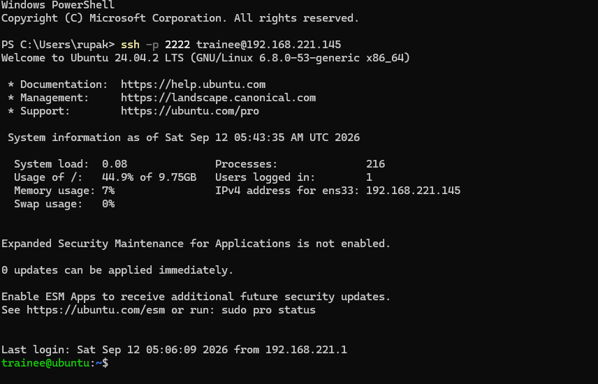
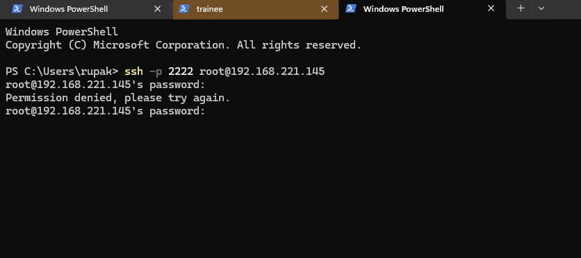
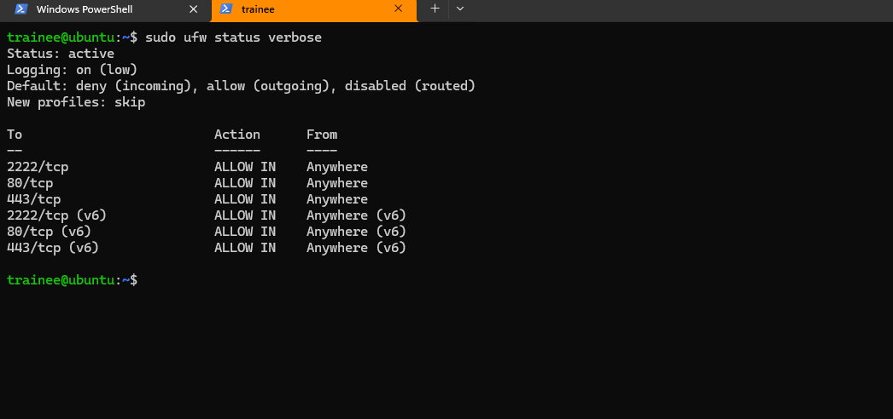
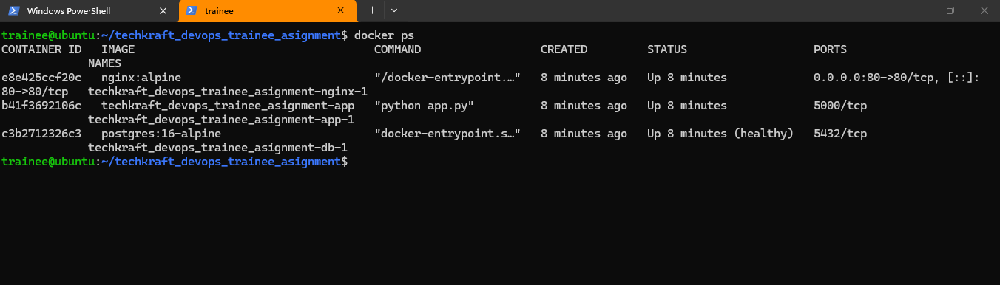
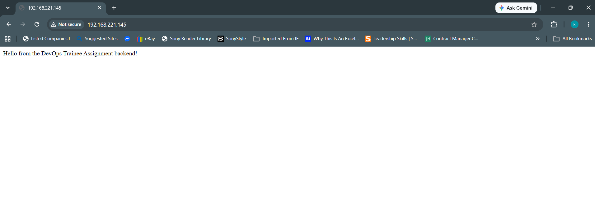
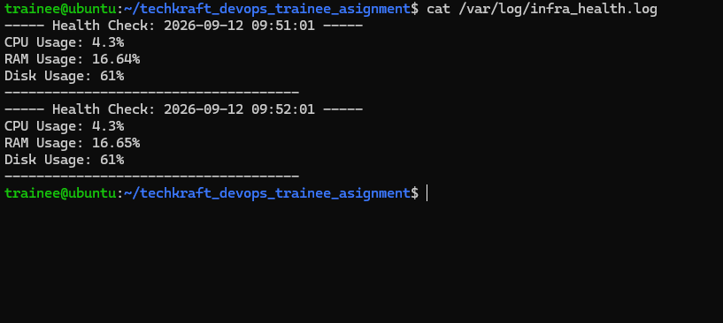
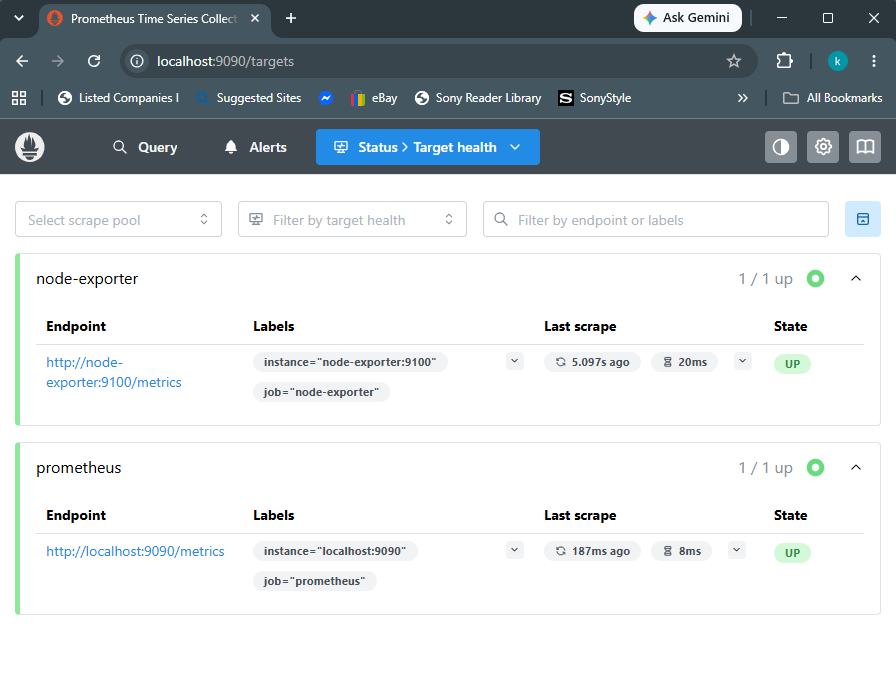
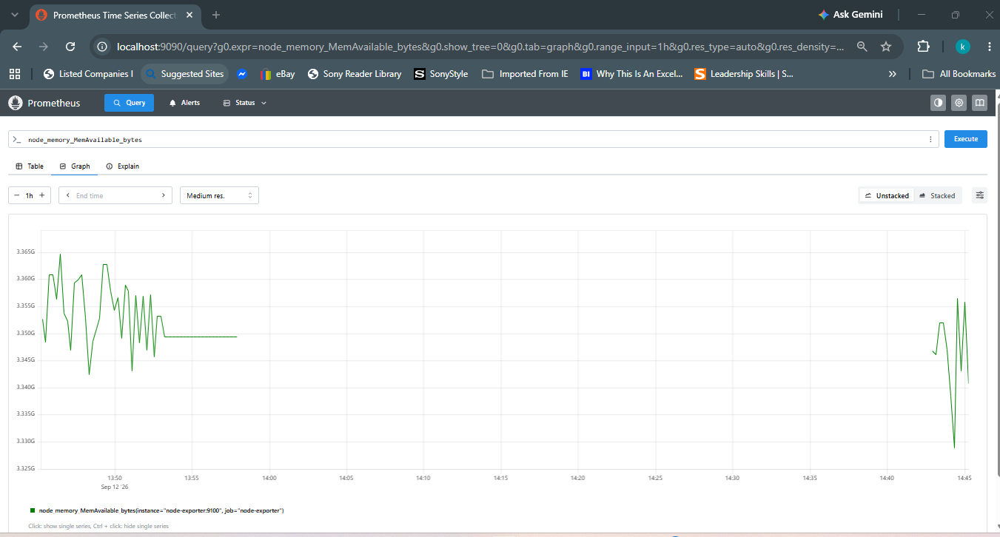

# IT Infrastructure & DevOps Trainee Practical Assignment

## Task 1: System Provisioning & Linux Administration

### Steps
1. Created `trainee` user with sudo privileges:

commands used:
- sudo adduser trainee
- sudo usermod -aG sudo trainee

2. Generated an SSH key pair on host, copied public key to `trainee`'s `~/.ssh/authorized_keys`.
3. Hardened `/etc/ssh/sshd_config`by adding the following lines
   - `Port 2222`
   - `PermitRootLogin no`
   - `PasswordAuthentication no`
   - `PubkeyAuthentication yes`
4. Disabled `ssh.socket` because Ubuntu 22.04 socket activation overrides `sshd_config`'s `Port` directive otherwise(found this the hard way. spent an hour debuging this single step):
- commands used:
    - sudo systemctl stop ssh.socket
    - sudo systemctl disable ssh.socket
    - sudo systemctl restart ssh.service

5. Configured UFW to allow only SSH at port 2222, HTTP at port 80, HTTPS at port 443:

- Commands used:
    - sudo ufw allow 2222/tcp
    - sudo ufw allow 80/tcp
    - sudo ufw allow 443/tcp
    - sudo ufw enable


### Verification
- `ssh -p 2222 trainee@192.168.221.145` connects via key, no password prompt.

- `ssh -p 2222 root@192.168.221.145` is rejected (root login disabled).

- `sudo ufw status verbose` confirms only 2222/80/443 allowed:


## Task 2: Containerization & Web Services

### Stack
- **nginx** a reverse proxy that listens on host port 80 and forwards to the Flask app
- **app** a Flask backend app with internal port 5000 that is not exposed to host directly
- **db** a PostgreSQL persistent volume `db_data` including a healthcheck so `app` waits until the database is actually ready to accept connections, not just started

### Steps
1. Installed Docker Engine from Docker's official apt repo.
2. Built a minimal Flask app (`app/app.py`) returning a confirmation message.
3. Wrote `nginx/nginx.conf` to reverse-proxy all requests to the Flask app container by service name.
4. Wrote `docker-compose.yml` defining all three services, with:
   - A named volume for Postgres data persistence
   - A bind-mounted `nginx.conf`
   - A `healthcheck` on `db` using `pg_isready`, and `depends_on: condition: service_healthy` on `app`

### Verification

- docker compose up -d --build
- docker ps



Routing verified via:

curl http://localhost/

and via browser at `http://192.168.221.142/`:



## Task 3: Automation & Shell Scripting

### Script: `/opt/scripts/infra_health_check.sh`
Checks CPU, RAM, and root disk usage, verifies Docker is running and the app container is up. If disk usage exceeds 85% or the app container is stopped it prints a `[WARNING]` and appends a timestamped entry to `/var/log/infra_health.log`.

### Cron job
Runs every 15 minutes via `trainee`'s crontab:

*/15 * * * * /opt/scripts/infra_health_check.sh >> /var/log/infra_health_cron.log 2>&1


### Verification
- Manual run confirmed CPU/RAM/disk stats print correctly.
- Stopping the app container and re-running triggered a `[WARNING]` and a log entry in `/var/log/infra_health.log`.
- Cron job confirmed firing by temporarily setting it to run every minute and checking `/var/log/infra_health_cron.log` for output.



## Task 4: Monitoring, Backups & Disaster Recovery

### Database Backup
Script: `/opt/scripts/db_backup.sh` dumps the PostgreSQL database via `pg_dump` inside the `db` container, compresses it to `.tar.gz`, stores it in `/var/backups/db/` with a `db_backup_YYYYMMDD.sql.tar.gz` naming format. Includes a 7-day retention policy that deletes backups older than 7 days.

Runs daily via cron at 2 AM:

0 2 * * * /opt/scripts/db_backup.sh >> /var/log/db_backup_cron.log 2>&1


### Restore Procedure
Documented in [`docs/restore-instructions.md`](docs/restore-instructions.md). **Tested end-to-end**: created a table with data, took a backup, dropped the table which simulates data loss, restored from the backup archive, and confirmed the data returned intact.

### Monitoring — Prometheus + Node Exporter
- **Node Exporter** exposes host-level metrics (CPU, memory, disk, network) on port 9100.
- **Prometheus** scrapes Node Exporter every 15 seconds and stores the time-series data, with a web UI on port 9090.
- Port 9090/9100 are intentionally not opened in UFW to keep Task 1's hardening intact. access is enabled via SSH port forwarding:
```bash
  ssh -p 2222 -L 9090:localhost:9090 trainee@192.168.221.145
  ssh -p 2222 -L 9100:localhost:9100 trainee@192.168.221.145
```
  then browse to `http://localhost:9090` on the host.

### Verification
Both scrape targets confirmed healthy via the Prometheus UI:



Live metrics confirmed via a graphed query (`node_memory_MemAvailable_bytes`):



## Task 5: Git & Documentation

### Branching strategy
Work was split into feature branches by task area, each merged into `main` once verified:
- `feature/linux-hardening` — Task 1 (user, SSH, UFW)
- `feature/docker-setup` — Task 2 (Flask app, Nginx, Docker Compose)
- `feature/backups-monitoring` — Task 4 (backup script, restore docs, Prometheus/Node Exporter)
- `feature/final-docs` — final README review and teardown documentation

Commits were made incrementally as each piece was completed and verified, rather than as a single dump at the end. 

### Repository structure
```
├── app/                    # Flask backend + Dockerfile
├── nginx/                  # Reverse proxy config
├── monitoring/             # Prometheus config
├── scripts/                # infra_health_check.sh, db_backup.sh
├── docs/
│   ├── screenshots/        # Verification screenshots
│   └── restore-instructions.md
├── docker-compose.yml
└── README.md
```